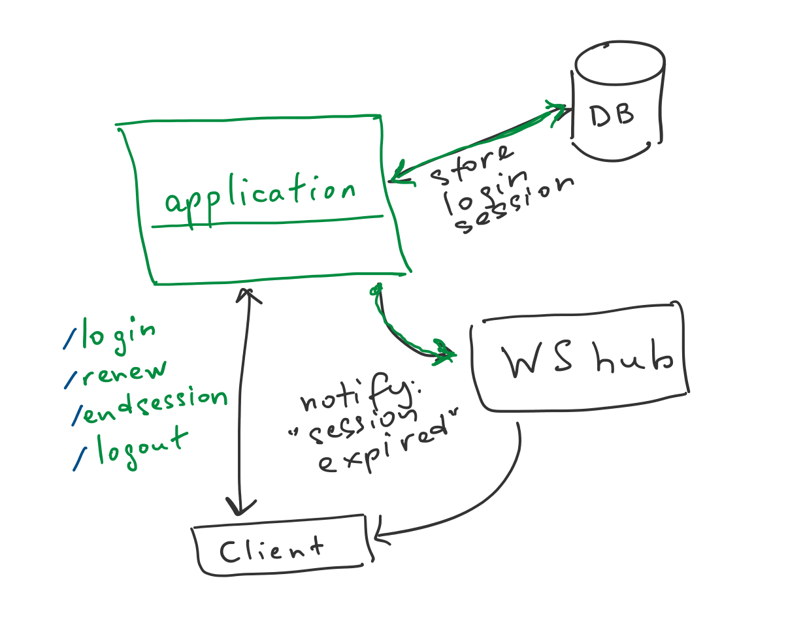

# Login sessions management

**Goal:** design a component responsible for operations with login sessions in some app.

**Format:** work in group of 2-3 people. (Note: "2-3" means exactly 2 or 3. Not 1, not 4.)

**Deliverables:** assignment acceptance criteria consist of 
1) correct (compilable!) code; 
2) passing unit tests with reasonable coverage (>80%); 
3) diagram of _explicit and implicit_ dependencies (simplified UML-style: only boxes and arrows).

---------

## I. Component behavior

From _end-user point of view_, app should have capabilities listed below. **Note**: these are top-level requirements, internal design can be more sophisticated.

| #    | Feature | Input | Logic | Output | 
|------|-----|-----|-----|----|
| 1 | Login | username, password | for valid input, start new login session, issue access token | access token |
| 2 | Logout | - | end current login session, invalidate access token | - |
| 3 | End session | session (other than the current one) | requires valid access token | - |
| 4 | Renew token/session | current session | works both with valid token **_or invalid token if session is still valid_**; old session ends, new session starts | new access token |
| 5* | Auto-end session | - | After defined period, end session and notify client through WebSocket hub (see picture) | - |

### Some rules
1. Access token is valid for 1 hour
2. Login session is valid for 6 hours
3. While login session is still valid, even invalid access token can be used for renewing login session

## II. Implementation

### Scope

No need to implement a fully-functional application. You have to design only a library capable of managing login sessions (see green on the picture). Those parts in grey like DB and WS hub are out of scope here. Assume you just interact with them in some way, no need to make real calls to any real DB etc. Just design what input your component expects, what output returns, and what side-effects produces (calls outside).

### Tests

You have to cover your code with unit tests as much as possible (>80% coverage). Code included in this repository gives a sample of writing unit test for `download()` function from "Refunds" project from lectures. You can use given project structure for your implementation.

To run tests, in tests folder `KmaOoad.Coding.201.Tests` run command `dotnet test`.
 

### Development setup

* latest .NET 5 RC1 SDK ([link](https://dotnet.microsoft.com/download/dotnet/5.0))
* editor of your taste, e.g. Visual Studio OR Visual Studio Code with Ionide and Omnisharp extensions OR JetBrains Rider (see more here for [Linux](https://fsharp.org/use/linux/), [Windows](https://fsharp.org/use/windows/), and [Mac](https://fsharp.org/use/mac/))

----------

**\* Hint**: _for feature #5, there are two ways to monitor session expiration: 1) from app itself, e.g. with some timer; 2) using external notifications – from the storage or other tool – e.g. Redis storage allows to set expiration time for stored value and sends notification to the app when value expires._

